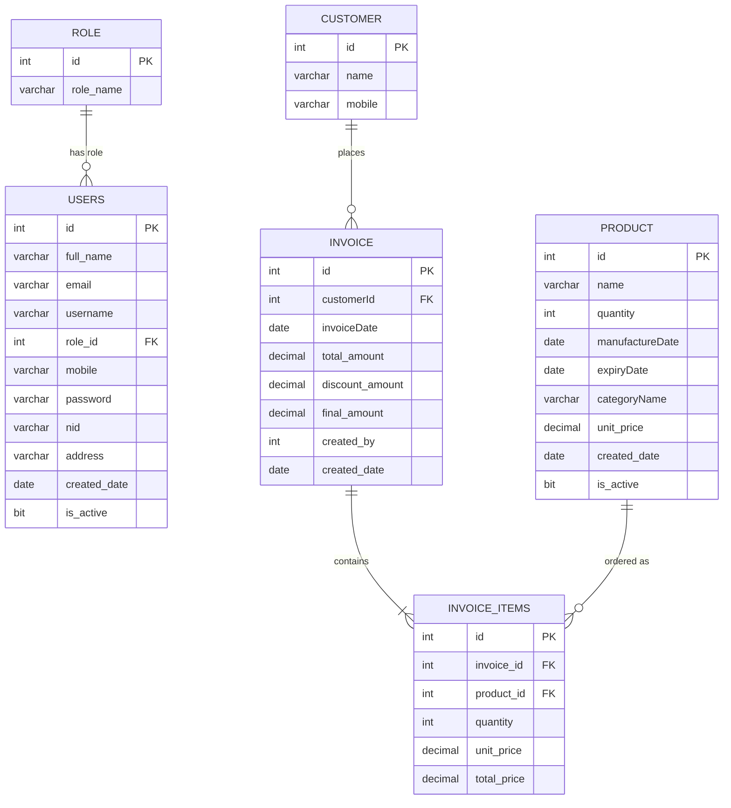

# 🛒 Jonotar Haat Bazaar (Shop Inventory & Sales Management System)

<p align="center">
  
</p>

<p align="center"> 
  <a href="https://github.com/iammrranik"> 
     
  </a> 
</p>

---

## ✨ Status
🚧 **Completed**  
🧠 Built with C# & .NET Framework 4.8  
🗄️ Powered by MS SQL Server & ADO.NET (`SqlConnection`, `SqlCommand`)  
🔐 Multi-Role Access Control (Administrator & Employee)  
🎯 Designed for Inventory Control & Dynamic Sales Invoicing  

---

## 📋 System Overview

**Jonotar Haat Bazaar** (translates to *People's Market*) is a comprehensive desktop-based shop inventory and sales invoicing management application. The system provides a centralized platform for store operators to manage system users, track inventory products, run checkouts, generate thermal-style invoices, print receipts and analyze overall store sales performance.

---

## 🔥 Features

- 👥 **Multi-Role User Control System (RBAC)** – Security routing restricting access to **Admin** (user/product CRUD, full database operations) and **Employee** (sales processing and inventory views) roles.
  - 🔑 **Auto-Password Generation**: New user passwords are automatically generated in the format `username@mobile_last_4_digits`.
  - 🛡️ **Unique Fields Validation**: Enforces database-level uniqueness checking for Email, Username, Mobile and NID during user creation and updates.
- 📦 **Comprehensive Product Inventory** – Track stock levels, category classifications, unit prices, manufacture dates and expiry dates, with built-in date validations.
- 🛒 **Dynamic Point of Sale (POS) Checkout** – Add products to a digital cart, check real-time stock availability, apply discounts and dynamically calculate final totals.
- 📄 **Receipt Printing Engine** – Generates structured, thermal-style text invoices, detailing purchased items, customer information, discount details and the serving employee. Integrates directly with Windows standard `PrintDialog`.
- 🔄 **Transactional Stock Restoration** – Editing or deleting sales invoices automatically restores the sold product quantities back to the inventory stock to prevent data discrepancy.
- 📊 **Detailed Sales Performance Analytics** – Monitor key metrics such as Total Sales, Total Discounts, Net Sales and Average Invoice Value. Features pre-set filters (Today, This Month, This Year, Custom Ranges) and CSV/TXT exports.
- 🔐 **Active Account Verification** – Restricts system access by preventing disabled users from logging in, even with valid credentials.

---

## 📌 Tech Stack

| Technology | Purpose | Version / Details |
|---|---|---|
| **C#** | Primary Language | 7.3+ |
| **.NET Framework** | Runtime Environment | 4.8 |
| **Windows Forms** | Desktop GUI Library | WinForms Designer |
| **MS SQL Server** | Relational Database Engine | LocalDB / Express |
| **ADO.NET** | Data Access API | `SqlConnection`, `SqlCommand`, `SqlDataAdapter` |
| **Visual Studio** | Development IDE | 2022 / 2019 |

---

## 🗂️ Project Architecture & Structure

```text
├── JonotarHaatBazaarSolution.sln            # Visual Studio Solution File
├── README.md                                # Root Project Readme
├── Project Report on Jonotar Haat Bazaar.pdf# Comprehensive Project Report Documentation
└── JonotarHaatBazaarProject/                # C# Windows Forms Project Source
    ├── JonotarHaatBazaarProject.csproj      # MSBuild C# Project Configuration
    ├── Program.cs                           # Main Application Entry Point
    ├── App.config                           # Database Connection String & Framework Configuration
    ├── sql.txt                              # SQL Schema Creation and Seed Data Script
    ├── JonotarHaatBazaarDataSet.xsd         # XML Schema for Datasets (with Designer.cs)
    ├── DB/
    │   └── DbAccess.cs                      # Database Helper Wrapper (ADO.NET operations)
    ├── GUI/
    │   ├── FormLogin.cs                     # Login Screen with Active User validation
    │   ├── FormAdmin.cs                     # Main Admin Dashboard View
    │   ├── FormEmployee.cs                  # Main Employee Dashboard View
    │   ├── UserControlAdmin.cs              # User Management View (List, Search, CRUD Trigger)
    │   ├── UserControlProduct.cs            # Product Inventory View (List, Search, CRUD Trigger)
    │   ├── FormAddUser.cs                   # Add New User form with validation
    │   ├── FormEditUser.cs                  # Edit User form with validation
    │   ├── FormAddProduct.cs                # Add / Update Product form with Date validation
    │   ├── FormAddCustomer.cs               # Customer creation drawer during checkouts
    │   ├── FormAddSale.cs                   # Checkout interface (Cart, Totals, Invoice Save)
    │   ├── FormInvoicePrint.cs              # Receipt details compiler & print layout wrapper
    │   └── FormSalesReport.cs               # Analytics dashboard with exportable filters
    └── Properties/
        ├── AssemblyInfo.cs                  # Project Assembly Metadata
        ├── Resources.resx                   # Project Images, Icons and Localized strings
        └── Settings.settings                # Application-scope Connection Settings
```

---

## 🚦 GUI Navigation & Access Matrix

The system maps application screens and user actions to the security roles:

| View / Form | Role Access | Key User Actions & Controls | Database Interaction |
| :--- | :--- | :--- | :--- |
| **[FormLogin](JonotarHaatBazaarProject/GUI/FormLogin.cs)** | Public | Login credentials input (`txtUsername`, `txtPassword`) | Reads `users` & `role` tables |
| **[FormAdmin](JonotarHaatBazaarProject/GUI/FormAdmin.cs)** | Admin | Main dashboard routing to user/product management, sales report | N/A (navigation container) |
| **[FormEmployee](JonotarHaatBazaarProject/GUI/FormEmployee.cs)** | Employee | Main dashboard routing to add sale, search products, sales report | N/A (navigation container) |
| **[UserControlAdmin](JonotarHaatBazaarProject/GUI/UserControlAdmin.cs)** | Admin | View users list, search by full name, remove user | Selects from `users`, deletes from `users` |
| **[UserControlProduct](JonotarHaatBazaarProject/GUI/UserControlProduct.cs)** | Admin | View products list, search by name, delete product | Selects from `product`, deletes from `product` |
| **[FormAddUser](JonotarHaatBazaarProject/GUI/FormAddUser.cs)** / **[FormEditUser](JonotarHaatBazaarProject/GUI/FormEditUser.cs)** | Admin | Add/Edit user details (`full_name`, `email`, `username`, `password`, `nid`, `mobile`, `address`, `role_id`, `is_active`) | Inserts or Updates `users` table |
| **[FormAddProduct](JonotarHaatBazaarProject/GUI/FormAddProduct.cs)** | Admin | Add/Edit product details (`name`, `quantity`, `manufactureDate`, `expiryDate`, `categoryName`, `unit_price`, `is_active`) | Inserts or Updates `product` table |
| **[FormAddSale](JonotarHaatBazaarProject/GUI/FormAddSale.cs)** | Admin / Employee | Add items to cart, auto-calculate total/discount/final price, save invoice | Inserts into `invoice` & `invoice_items`, updates `product` stock quantity |
| **[FormInvoicePrint](JonotarHaatBazaarProject/GUI/FormInvoicePrint.cs)** | Admin / Employee | View text receipt preview, select printer & print invoice | Reads `invoice`, `invoice_items`, `product`, `customer`, `users` |
| **[FormSalesReport](JonotarHaatBazaarProject/GUI/FormSalesReport.cs)** | Admin / Employee | Filter invoices by date range, view summary statistics (Total, Net Sales, Avg Sale), delete invoice (reverts stock), export CSV | Selects from `invoice` and `invoice_items`, deletes from `invoice_items`/`invoice`, updates `product` quantity |
| **[FormAddCustomer](JonotarHaatBazaarProject/GUI/FormAddCustomer.cs)** | Admin / Employee | Add customer mobile and name during sale checkout | Inserts into `customer` table |

---

## 🗄️ Relational Database Schema

The system uses Microsoft SQL Server. The database schema design adheres to **2NF (Second Normal Form)** principles to minimize data redundancy and ensure data integrity.

The tables and associations are structured as follows:



---

## 📝 Design & Architecture Details

The project utilizes a structured, desktop layered approach:
- **Database Helper (`DbAccess.cs`)**: Centralizes the opening and closing of database resources. Encapsulates ADO.NET procedures for `ExecuteQuery` (returns `DataSet`), `ExecuteQueryTable` (returns `DataTable`), `ExecuteDMLQuery` (returns affected rows count) and `ExecuteRowCountQuery`.
- **Validation Engine**: Forms such as `FormAddProduct` validate data inputs client-side, showing error labels and highlighting fields in red for issues (e.g., negative prices/quantities, manufacture dates in the future, or expiry dates preceding manufacture dates).
- **POS Invoicing Workflows**:
  - **Save Invoicing**: Inserts header data into `invoice`, grabs the generated ID using `SCOPE_IDENTITY()`, iterates through the cart list to insert details into `invoice_items` and deducts product quantities from inventory.
  - **Edit Invoicing**: Automatically restores old quantities, clears the old items list, updates the invoice header and then processes the new items list with appropriate stock deduction.
  - **Revert Deletions**: Deleting an invoice from the sales report screen automatically triggers an SQL script to add back the purchased quantities to the database, ensuring that inventory counts are consistently accurate.

---

## 🚦 Setup and Local Execution

### Prerequisites
- Visual Studio 2019/2022 with **.NET Desktop Development** workload installed.
- Microsoft SQL Server LocalDB or Express instance.
- .NET Framework 4.8.

### Setup Steps
1. **Initialize the Database**:
   - Open SQL Server Management Studio (SSMS) or Visual Studio SQL Server Object Explorer.
   - Connect to your SQL Server instance (e.g., `(localdb)\MSSQLLocalDB` or `.\SQLEXPRESS`).
   - Create a database named `JonotarHaatBazaarDB`.
   - Run the contents of the `sql.txt` script to create the database schema tables and seed basic roles and the default admin user.

2. **Configure Database Connection**:
   - Open the file `JonotarHaatBazaarProject/DB/DbAccess.cs`.
   - Update the connection string constructor to point to your SQL Server instance:
     ```csharp
     this.Sqlcon = new SqlConnection(@"Data Source=YOUR_SERVER_NAME;Initial Catalog=JonotarHaatBazaarDB;Integrated Security=True;Encrypt=False");
     ```
   > [!IMPORTANT]
   > Make sure to replace **`YOUR_SERVER_NAME`** with your actual SQL Server instance name (e.g., `DESKTOP-41QHCLF\DB`, `(localdb)\MSSQLLocalDB` or `.\SQLEXPRESS`).


3. **Compile & Run**:
   - Open `JonotarHaatBazaarSolution.sln` in Visual Studio.
   - Build the solution (`Ctrl + Shift + B`) to verify all references are resolved.
   - Run the project (`F5`).

### Default Credentials
- **Role**: Administrator
- **Username**: `admin`
- **Password**: `admin123`

---

## 🏆 Credits

Developed by [iammrranik](https://github.com/iammrranik) for the Shop Inventory & Sales Management system.

<p align="center">
  
</p>
